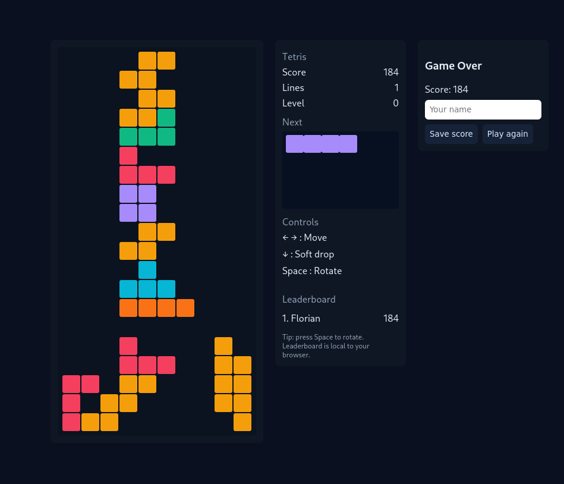

# Tetris Webapp

## 🤖 Code généré par IA

**Ce projet a été entièrement généré avec seulement 3 prompts envoyés à GPT-5.** Aucune ligne de code n'a été écrite manuellement - tout le code source, la configuration Docker, les workflows CI/CD et la documentation ont été créés exclusivement par intelligence artificielle.

Un jeu de Tetris en React avec score, niveau, lignes complétées, aperçu du prochain bloc et un leaderboard stocké en localStorage.
## Aperçu


## Fonctionnalités
- Contrôles :
  - **← / →** : déplacer la pièce
  - **↓** : descente rapide
  - **Espace** : rotation
- Leaderboard local (10 meilleurs scores)
- Difficulté progressive selon le nombre de lignes complétées
- Aperçu du prochain bloc
- Mode responsive

## Installation locale
```bash
npm install
npm run start
```
Puis ouvrez [http://localhost:5173](http://localhost:5173).

## Build et exécution avec Docker
```bash
docker compose up --build
```
Puis ouvrez [http://localhost:8080](http://localhost:8080).

## Structure
- `src/` : code source React
- `public/` : HTML de base
- `Dockerfile` : build multi-stage Node + Nginx
- `docker-compose.yml` : déploiement simple

## Pipeline CI/CD
Le fichier `.github/workflows/docker-build.yml` est fourni pour automatiser le build et le push de l'image Docker sur GitHub Container Registry.
